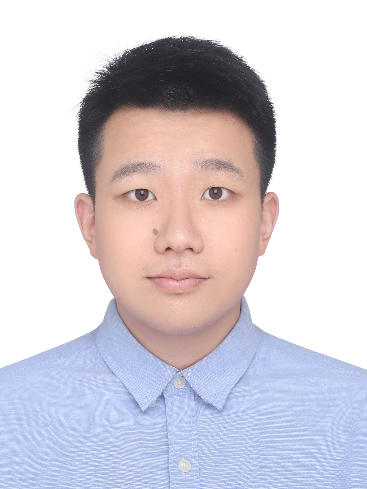

  
  
  

    <h1>Jiawen Gu (顾嘉汶)</h1>
    
M.S. Student in Computer Science

    
Shanghai Normal University

    
    <!-- 

      <a href="mailto:your.email@example.com"> Email</a>
      <a href="https://github.com/gujiawen777"> GitHub</a>
      <a href="https://scholar.google.com/"> Google Scholar</a>
    
 -->
  

---

## About Me

I am a Master's student at Shanghai Normal University, focusing on developing **robust and generalizable machine learning systems** for ubiquitous sensing and wearable technology. My research centers on **Domain Generalization (DG)** and **Human Activity Recognition (HAR)**.

## Research Interests

- 🤖 **LLM-Driven Multimodal Sensing Agents**: Exploring the synergy between large language models and multimodal sensor data to build context-aware agents
- 🔄 **Adaptive Continual Learning for HAR**: Designing algorithms that enable models to incrementally learn new user behaviors without catastrophic forgetting
- 🎯 **Domain Generalization**: Enhancing cross-user HAR accuracy through meta-learning and feature disentanglement

<!-- ## News

- **2025** - Paper accepted to **ICME 2026**
- **2025** - First Prize, Shanghai Informatics Society Excellent Achievement Award
- **2025** - Second Prize (National Level), China Graduate Mathematical Modeling Competition -->

## Selected Publications

!!! info "ICME 2026 (Accepted)"
    **Generalizable Sensor-Based Human Activity Recognition via Seasonal Style Projection and Trend Feature Disentanglement**
    
    Jianguo Pan, **Jiawen Gu**, Shunye Wang, Yewei Zhou, Peichi Zhou, Yuan Yang*

See [Publications](publications.md) for full list.

## Contact

📧 Email: 1006893541@qq.com

📍 Shanghai, China